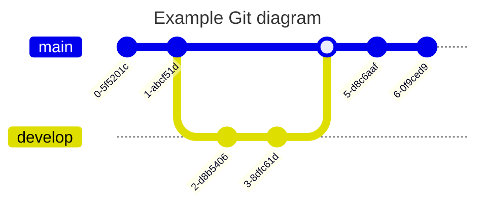
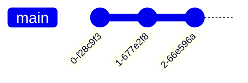
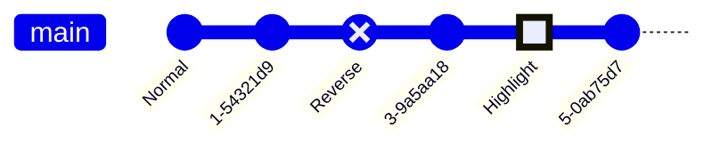
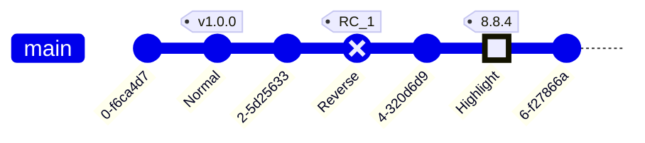
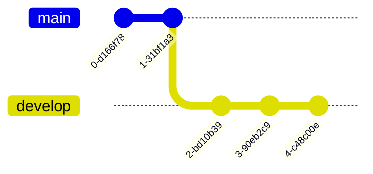
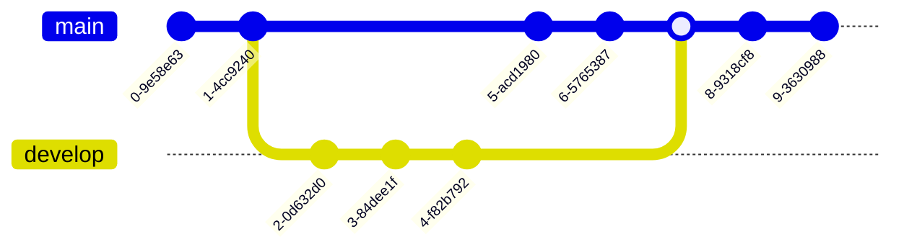
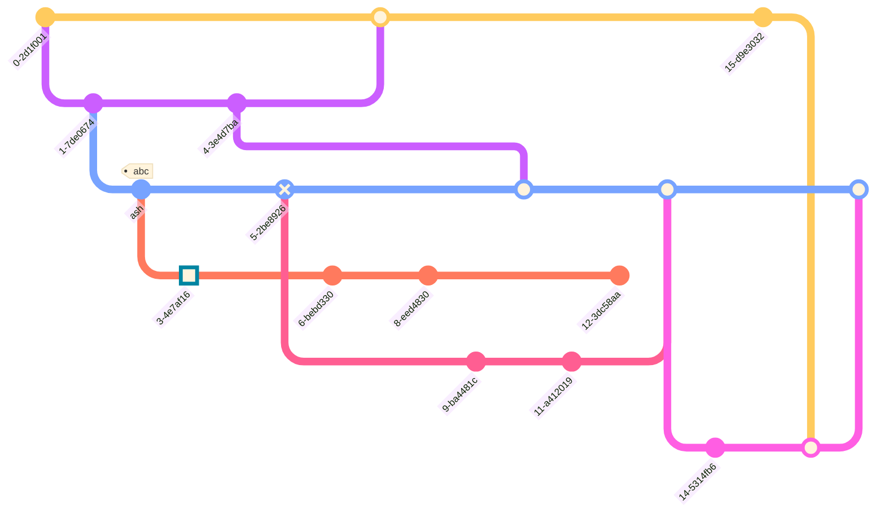
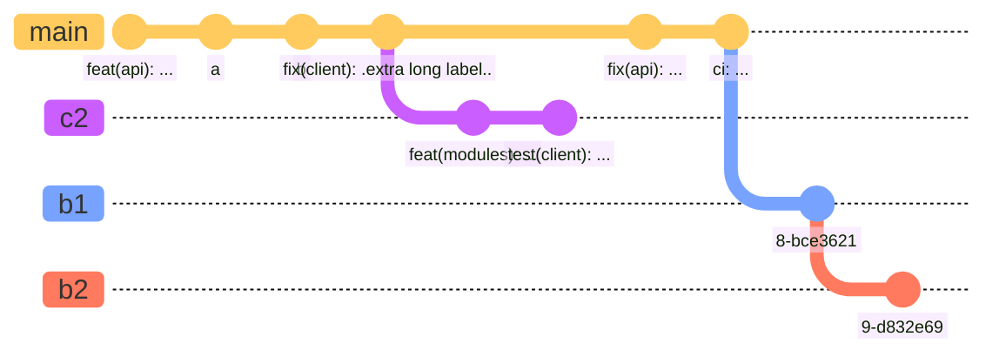
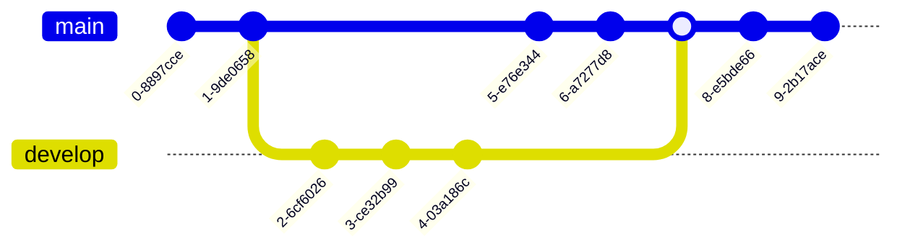
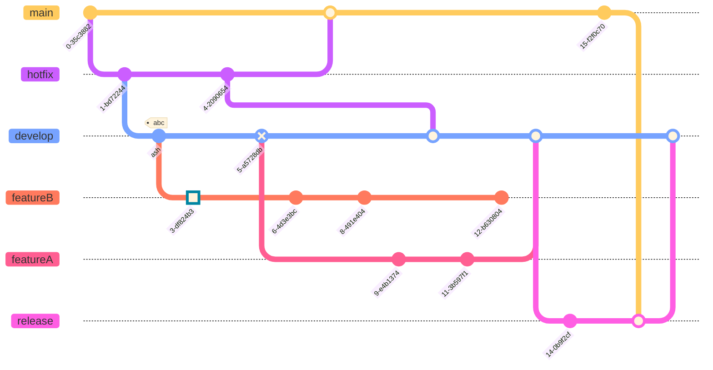

1  


2  


3  


4  


5  


6  


7  


8  


9  


10  


11  


12  


13  


14  


15  


16  


17  


18  


19  


20  


21  
```mermaid
%%{init: { 'logLevel': 'debug', 'theme': 'forest' } }%%
      gitGraph
        commit
        branch hotfix
        checkout hotfix
        commit
        branch develop
        checkout develop
        commit id:"ash" tag:"abc"
        branch featureB
        checkout featureB
        commit type:HIGHLIGHT
        checkout main
        checkout hotfix
        commit type:NORMAL
        checkout develop
        commit type:REVERSE
        checkout featureB
        commit
        checkout main
        merge hotfix
        checkout featureB
        commit
        checkout develop
        branch featureA
        commit
        checkout develop
        merge hotfix
        checkout featureA
        commit
        checkout featureB
        commit
        checkout develop
        merge featureA
        branch release
        checkout release
        commit
        checkout main
        commit
        checkout release
        merge main
        checkout develop
        merge release
```

22  
```mermaid
%%{init: { 'logLevel': 'debug', 'theme': 'default' } }%%
      gitGraph
        commit type:HIGHLIGHT
        branch hotfix
        checkout hotfix
        commit
        branch develop
        checkout develop
        commit id:"ash" tag:"abc"
        branch featureB
        checkout featureB
        commit type:HIGHLIGHT
        checkout main
        checkout hotfix
        commit type:NORMAL
        checkout develop
        commit type:REVERSE
        checkout featureB
        commit
        checkout main
        merge hotfix
        checkout featureB
        commit
        checkout develop
        branch featureA
        commit
        checkout develop
        merge hotfix
        checkout featureA
        commit
        checkout featureB
        commit
        checkout develop
        merge featureA
        branch release
        checkout release
        commit
        checkout main
        commit
        checkout release
        merge main
        checkout develop
        merge release
```

23  
```mermaid
%%{init: { 'logLevel': 'debug', 'theme': 'dark' } }%%
      gitGraph
        commit
        branch hotfix
        checkout hotfix
        commit
        branch develop
        checkout develop
        commit id:"ash" tag:"abc"
        branch featureB
        checkout featureB
        commit type:HIGHLIGHT
        checkout main
        checkout hotfix
        commit type:NORMAL
        checkout develop
        commit type:REVERSE
        checkout featureB
        commit
        checkout main
        merge hotfix
        checkout featureB
        commit
        checkout develop
        branch featureA
        commit
        checkout develop
        merge hotfix
        checkout featureA
        commit
        checkout featureB
        commit
        checkout develop
        merge featureA
        branch release
        checkout release
        commit
        checkout main
        commit
        checkout release
        merge main
        checkout develop
        merge release
```

24  
```mermaid
%%{init: { 'logLevel': 'debug', 'theme': 'neutral' } }%%
      gitGraph
        commit
        branch hotfix
        checkout hotfix
        commit
        branch develop
        checkout develop
        commit id:"ash" tag:"abc"
        branch featureB
        checkout featureB
        commit type:HIGHLIGHT
        checkout main
        checkout hotfix
        commit type:NORMAL
        checkout develop
        commit type:REVERSE
        checkout featureB
        commit
        checkout main
        merge hotfix
        checkout featureB
        commit
        checkout develop
        branch featureA
        commit
        checkout develop
        merge hotfix
        checkout featureA
        commit
        checkout featureB
        commit
        checkout develop
        merge featureA
        branch release
        checkout release
        commit
        checkout main
        commit
        checkout release
        merge main
        checkout develop
        merge release
```

25  
```mermaid
%%{init: { 'logLevel': 'debug', 'theme': 'default' } }%%
       gitGraph
       commit
       branch develop
       commit tag:"v1.0.0"
       commit
       checkout main
       commit type: HIGHLIGHT
       commit
       merge develop
       commit
       branch featureA
       commit
```

26  
```mermaid
%%{init: { 'logLevel': 'debug', 'theme': 'default' , 'themeVariables': {
              'git0': '#ff0000',
              'git1': '#00ff00',
              'git2': '#0000ff',
              'git3': '#ff00ff',
              'git4': '#00ffff',
              'git5': '#ffff00',
              'git6': '#ff00ff',
              'git7': '#00ffff'
       } } }%%
       gitGraph
       commit
       branch develop
       commit tag:"v1.0.0"
       commit
       checkout main
       commit type: HIGHLIGHT
       commit
       merge develop
       commit
       branch featureA
       commit
```

27  
```mermaid
%%{init: { 'logLevel': 'debug', 'theme': 'default' , 'themeVariables': {
        'gitBranchLabel0': '#ffffff',
        'gitBranchLabel1': '#ffffff',
        'gitBranchLabel2': '#ffffff',
        'gitBranchLabel3': '#ffffff',
        'gitBranchLabel4': '#ffffff',
        'gitBranchLabel5': '#ffffff',
        'gitBranchLabel6': '#ffffff',
        'gitBranchLabel7': '#ffffff',
        'gitBranchLabel8': '#ffffff',
        'gitBranchLabel9': '#ffffff'
  } } }%%
  gitGraph
    checkout main
    branch branch1
    branch branch2
    branch branch3
    branch branch4
    branch branch5
    branch branch6
    branch branch7
    branch branch8
    branch branch9
    checkout branch1
    commit
```

28  
```mermaid
%%{init: { 'logLevel': 'debug', 'theme': 'default' , 'themeVariables': {
              'commitLabelColor': '#ff0000',
              'commitLabelBackground': '#00ff00'
       } } }%%
       gitGraph
       commit
       branch develop
       commit tag:"v1.0.0"
       commit
       checkout main
       commit type: HIGHLIGHT
       commit
       merge develop
       commit
       branch featureA
       commit
```

29  
```mermaid
%%{init: { 'logLevel': 'debug', 'theme': 'default' , 'themeVariables': {
              'commitLabelColor': '#ff0000',
              'commitLabelBackground': '#00ff00',
              'commitLabelFontSize': '16px'
       } } }%%
       gitGraph
       commit
       branch develop
       commit tag:"v1.0.0"
       commit
       checkout main
       commit type: HIGHLIGHT
       commit
       merge develop
       commit
       branch featureA
       commit
```

30  
```mermaid
%%{init: { 'logLevel': 'debug', 'theme': 'default' , 'themeVariables': {
              'commitLabelColor': '#ff0000',
              'commitLabelBackground': '#00ff00',
              'tagLabelFontSize': '16px'
       } } }%%
       gitGraph
       commit
       branch develop
       commit tag:"v1.0.0"
       commit
       checkout main
       commit type: HIGHLIGHT
       commit
       merge develop
       commit
       branch featureA
       commit
```

31  
```mermaid
%%{init: { 'logLevel': 'debug', 'theme': 'default' , 'themeVariables': {
              'tagLabelColor': '#ff0000',
              'tagLabelBackground': '#00ff00',
              'tagLabelBorder': '#0000ff'
       } } }%%
       gitGraph
       commit
       branch develop
       commit tag:"v1.0.0"
       commit
       checkout main
       commit type: HIGHLIGHT
       commit
       merge develop
       commit
       branch featureA
       commit
```
32  
```mermaid
%%{init: { 'logLevel': 'debug', 'theme': 'default' , 'themeVariables': {
              'gitInv0': '#ff0000'
       } } }%%
       gitGraph
       commit
       branch develop
       commit tag:"v1.0.0"
       commit
       checkout main
       commit type: HIGHLIGHT
       commit
       merge develop
       commit
       branch featureA
       commit
```
