1  
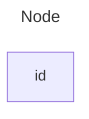

2  
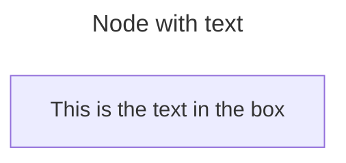

3  
```mermaid
flowchart LR
    id["This ❤ Unicode"]
```

4  
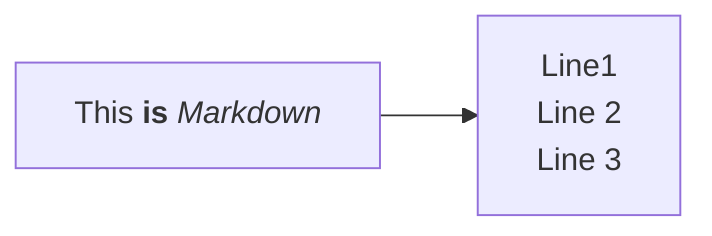

5  
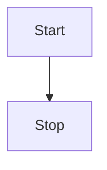

6  
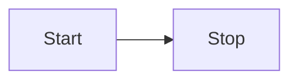

7  
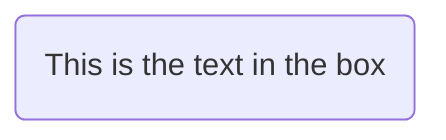

8  
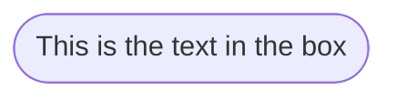

9  
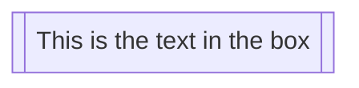

10  
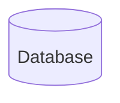

11  
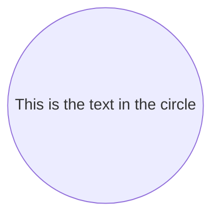

12  
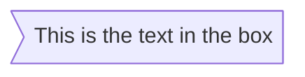

13  
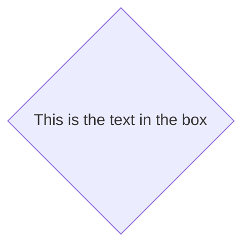

14  
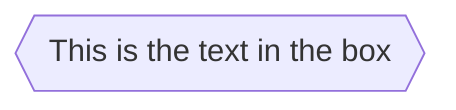

15  
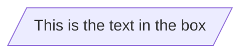

16  
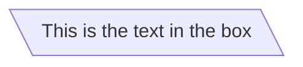

17  
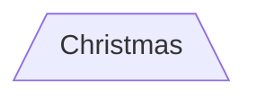

18  
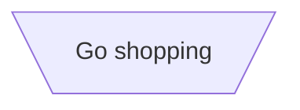

19  
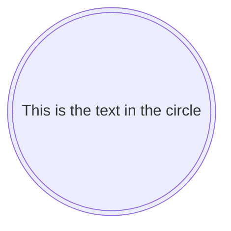

20  
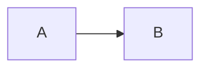

21  
```mermaid
flowchart LR
    A --- B
```

22  
```mermaid
flowchart LR
    A-- This is the text! ---B
```

23  
```mermaid
flowchart LR
    A---|This is the text|B
```

24  
```mermaid
flowchart LR
    A-->|text|B
```

25  
```mermaid
flowchart LR
    A-- text -->B
```

26  
```mermaid
flowchart LR
   A-.->B;
```

27  
```mermaid
flowchart LR
   A-. text .-> B
```

28  
```mermaid
flowchart LR
   A ==> B
```

29  
```mermaid
flowchart LR
   A == text ==> B
```

30  
```mermaid
flowchart LR
    A ~~~ B
```

31  
```mermaid
flowchart LR
   A -- text --> B -- text2 --> C
```

32  
```mermaid
flowchart LR
   a --> b & c--> d
```

33  
```mermaid
flowchart TB
    A & B--> C & D
```

34  
```mermaid
flowchart TB
    A --> C
    A --> D
    B --> C
    B --> D
```

35  
```mermaid
flowchart LR
    A --o B
    B --x C
```

36  
```mermaid
flowchart LR
    A o--o B
    B <--> C
    C x--x D
```

37  
```mermaid
flowchart TD
    A[Start] --> B{Is it?}
    B -->|Yes| C[OK]
    C --> D[Rethink]
    D --> B
    B ---->|No| E[End]
```

38  
```mermaid
flowchart TD
    A[Start] --> B{Is it?}
    B -- Yes --> C[OK]
    C --> D[Rethink]
    D --> B
    B -- No ----> E[End]
```

For dotted or thick links, the characters to add are equals signs or dots, as summed up in the following table:

Length	1	2	3
Normal	---	----	-----
Normal with arrow	-->	--->	---->
Thick	===	====	=====
Thick with arrow	==>	===>	====>
Dotted	-.-	-..-	-...-
Dotted with arrow	-.->	-..->	-...->


39  
```mermaid
flowchart LR
    id1["This is the (text) in the box"]
```


40  
```mermaid
flowchart LR
        A["A double quote:#quot;"] --> B["A dec char:#9829;"]
```

41  
```mermaid
flowchart TB
    c1-->a2
    subgraph one
    a1-->a2
    end
    subgraph two
    b1-->b2
    end
    subgraph three
    c1-->c2
    end
```

42  
```mermaid
flowchart TB
    c1-->a2
    subgraph ide1 [one]
    a1-->a2
    end
```

43  
```mermaid
flowchart TB
    c1-->a2
    subgraph one
    a1-->a2
    end
    subgraph two
    b1-->b2
    end
    subgraph three
    c1-->c2
    end
    one --> two
    three --> two
    two --> c2
```

44  
```mermaid
flowchart LR
  subgraph TOP
    direction TB
    subgraph B1
        direction RL
        i1 -->f1
    end
    subgraph B2
        direction BT
        i2 -->f2
    end
  end
  A --> TOP --> B
  B1 --> B2
```

45  
```mermaid
flowchart LR
    subgraph subgraph1
        direction TB
        top1[top] --> bottom1[bottom]
    end
    subgraph subgraph2
        direction TB
        top2[top] --> bottom2[bottom]
    end
    %% ^ These subgraphs are identical, except for the links to them:

    %% Link *to* subgraph1: subgraph1 direction is mantained
    outside --> subgraph1
    %% Link *within* subgraph2:
    %% subgraph2 inherits the direction of the top-level graph (LR)
    outside ---> top2
```

46  
```mermaid
%%{init: {"flowchart": {"htmlLabels": false}} }%%
flowchart LR
subgraph "One"
  a("`The **cat**
  in the hat`") -- "edge label" --> b{{"`The **dog** in the hog`"}}
end
subgraph "`**Two**`"
  c("`The **cat**
  in the hat`") -- "`Bold **edge label**`" --> d("The dog in the hog")
end
```

Formatting:

For bold text, use double asterisks (**) before and after the text.
For italics, use single asterisks (*) before and after the text.
With traditional strings, you needed to add <br> tags for text to wrap in nodes. However, markdown strings automatically wrap text when it becomes too long and allows you to start a new line by simply using a newline character instead of a <br> tag.
This feature is applicable to node labels, edge labels, and subgraph labels.


47  
```mermaid
flowchart LR
    A-->B
    B-->C
    C-->D
    click A callback "Tooltip for a callback"
    click B "https://www.github.com" "This is a tooltip for a link"
    click C call callback() "Tooltip for a callback"
    click D href "https://www.github.com" "This is a tooltip for a link"
```

48  
```mermaid
flowchart LR
    A-->B
    B-->C
    C-->D
    D-->E
    click A "https://www.github.com" _blank
    click B "https://www.github.com" "Open this in a new tab" _blank
    click C href "https://www.github.com" _blank
    click D href "https://www.github.com" "Open this in a new tab" _blank
```

49  
```mermaid
flowchart LR
%% this is a comment A -- text --> B{node}
   A -- text --> B -- text2 --> C
```

50  
```mermaid
flowchart LR
    id1(Start)-->id2(Stop)
    style id1 fill:#f9f,stroke:#333,stroke-width:4px
    style id2 fill:#bbf,stroke:#f66,stroke-width:2px,color:#fff,stroke-dasharray: 5 5
```

51  
```mermaid
flowchart LR
    A:::someclass --> B
    classDef someclass fill:#f96
```

52  
```mermaid
flowchart LR
    A:::foo & B:::bar --> C:::foobar
    classDef foo stroke:#f00
    classDef bar stroke:#0f0
    classDef foobar stroke:#00f
```

53  
```mermaid
flowchart TD
    B["fa:fa-twitter for peace"]
    B-->C[fa:fa-ban forbidden]
    B-->D(fa:fa-spinner)
    B-->E(A fa:fa-camera-retro perhaps?)
```

54  
```mermaid
flowchart LR
    A[Hard edge] -->|Link text| B(Round edge)
    B --> C{Decision}
    C -->|One| D[Result one]
    C -->|Two| E[Result two]
```
