1  
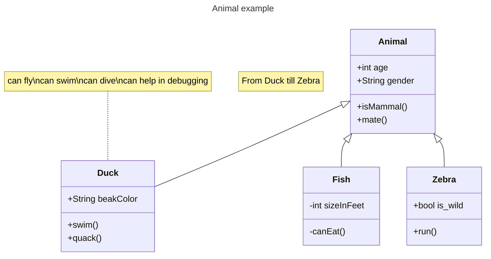

2  
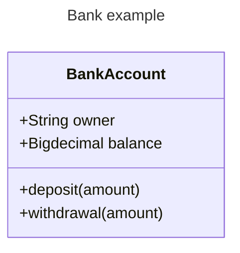

3  
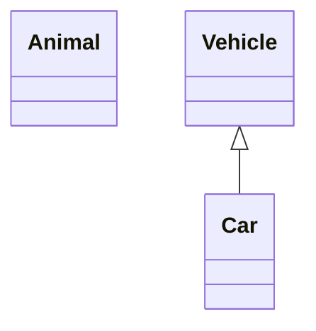

4  
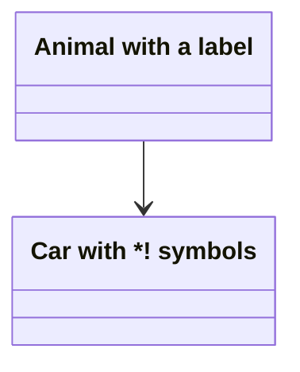

5  
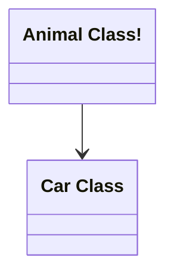

6  
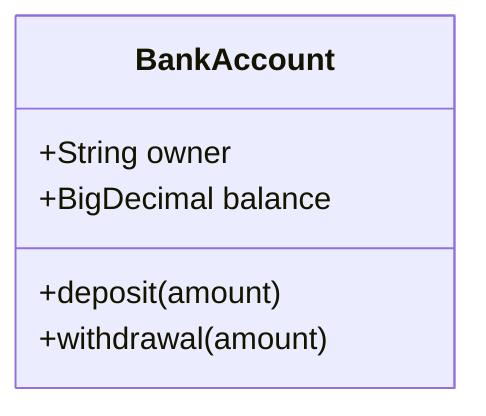

7  


8  
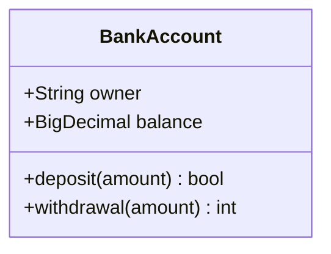

9  
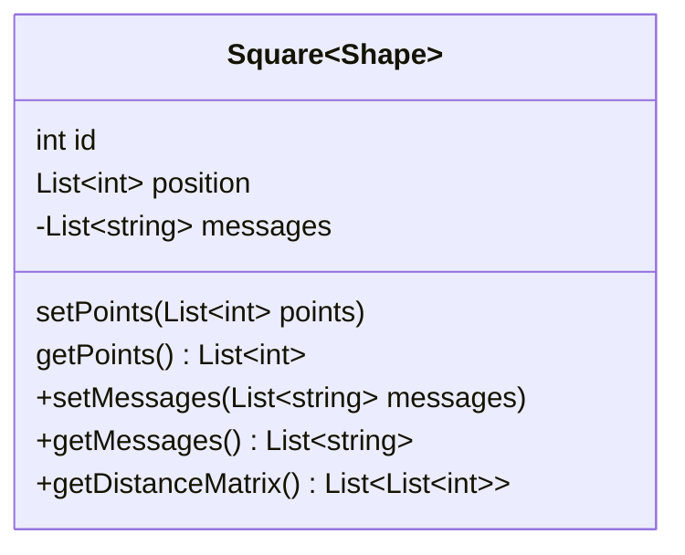

To describe the visibility (or encapsulation) of an attribute or method/function that is a part of a class (i.e. a class member), optional notation may be placed before that members' name:

+ Public
- Private
# Protected
~ Package/Internal
note you can also include additional classifiers to a method definition by adding the following notation to the end of the method, i.e.: after the () or after the return type:

* Abstract e.g.: someAbstractMethod()* or someAbstractMethod() int*
$ Static e.g.: someStaticMethod()$ or someStaticMethod() String$
note you can also include additional classifiers to a field definition by adding the following notation to the very end:

$ Static e.g.: String someField$


Type	Description
<|--	Inheritance
*--	Composition
o--	Aggregation
-->	Association
--	Link (Solid)
..>	Dependency
..|>	Realization
..	Link (Dashed)

10  
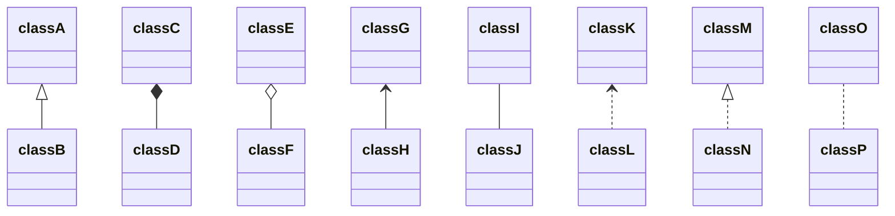

11  
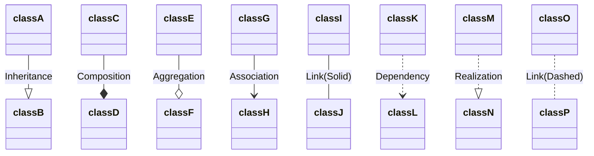

12  
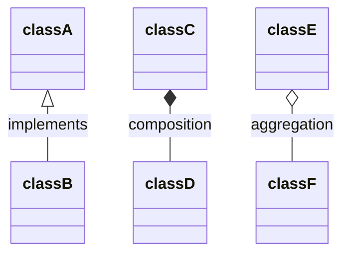

13  
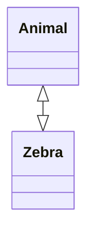

14  
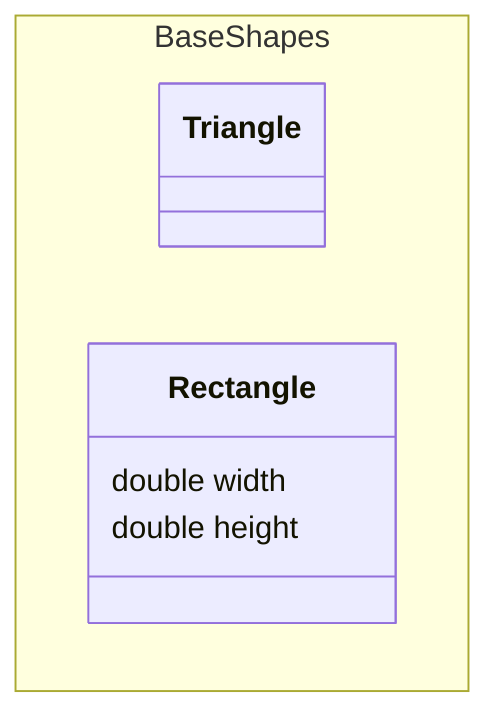

15  
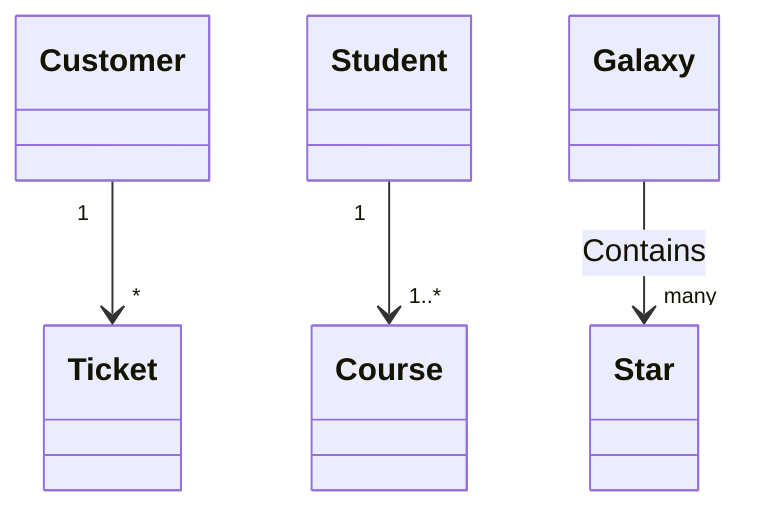

16  
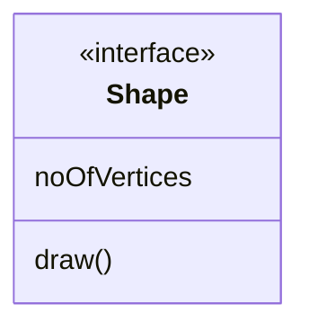

17  
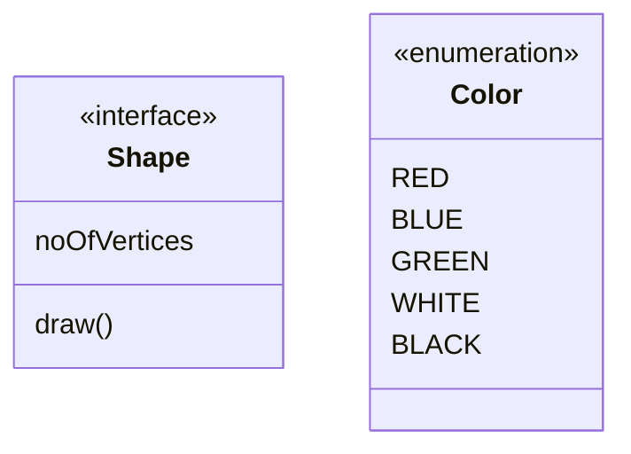

18  


19  
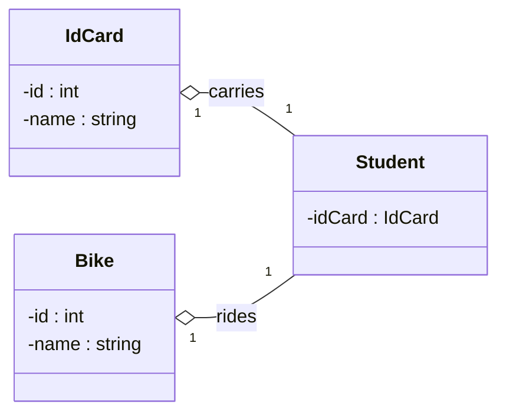

20  
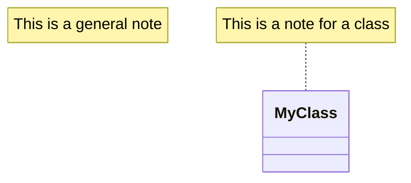

21  
```mermaid
classDiagram
class Shape
link Shape "https://www.github.com" "This is a tooltip for a link"
class Shape2
click Shape2 href "https://www.github.com" "This is a tooltip for a link"
```
