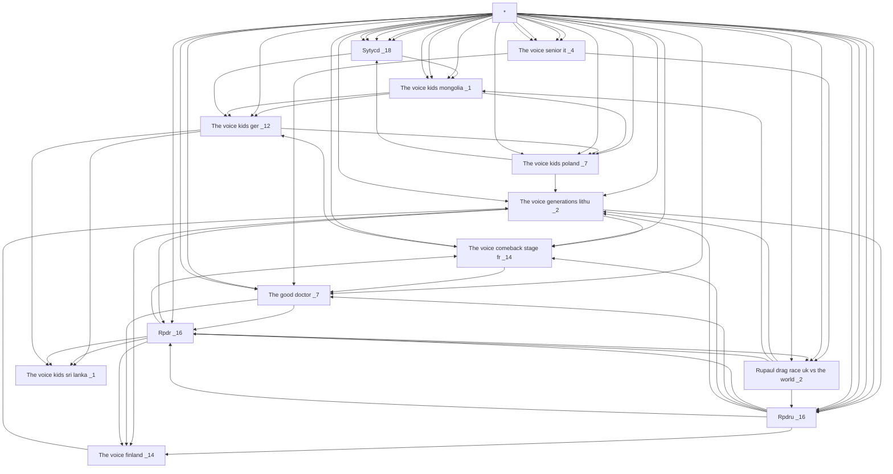
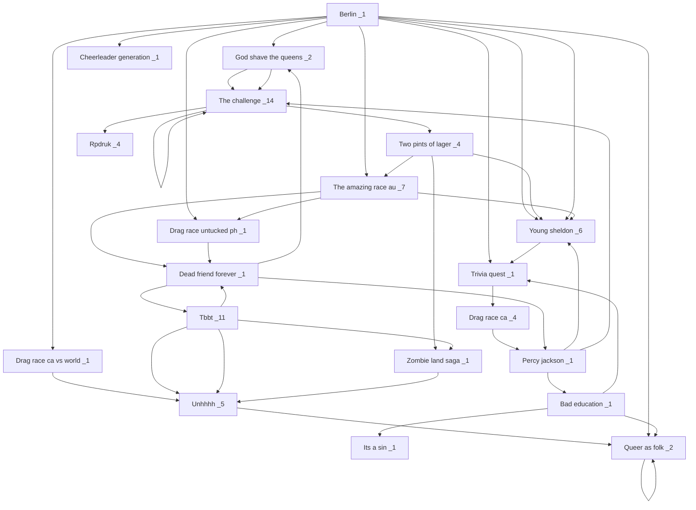

1   EN COURS


2  RETARD


3  
```mermaid
```

4  
```mermaid
```

5  
```mermaid
```

6  
```mermaid
```

7  
```mermaid
```

8  
```mermaid
```

9  
```mermaid
```

10  
```mermaid
```

11  
```mermaid
```

12  
```mermaid
```

13  
```mermaid
```

14  
```mermaid
```

15  
```mermaid
```

16  
```mermaid
```

17  
```mermaid
```

18  
```mermaid
```

19  
```mermaid
```

20  
```mermaid
```

21  
```mermaid
```

22  
```mermaid
```

23  
```mermaid
```

24  
```mermaid
```

25  
```mermaid
```

26  
```mermaid
```

27  
```mermaid
```

28  
```mermaid
```
