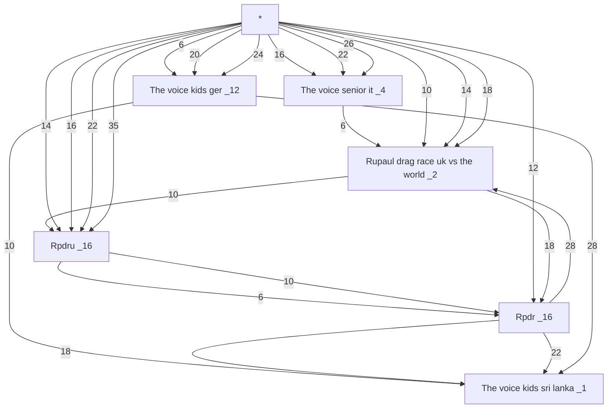
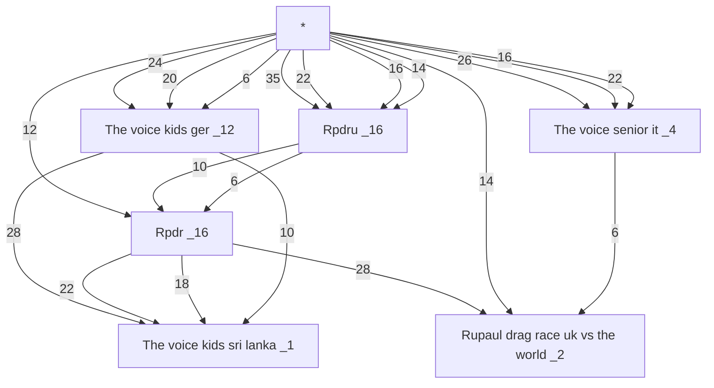
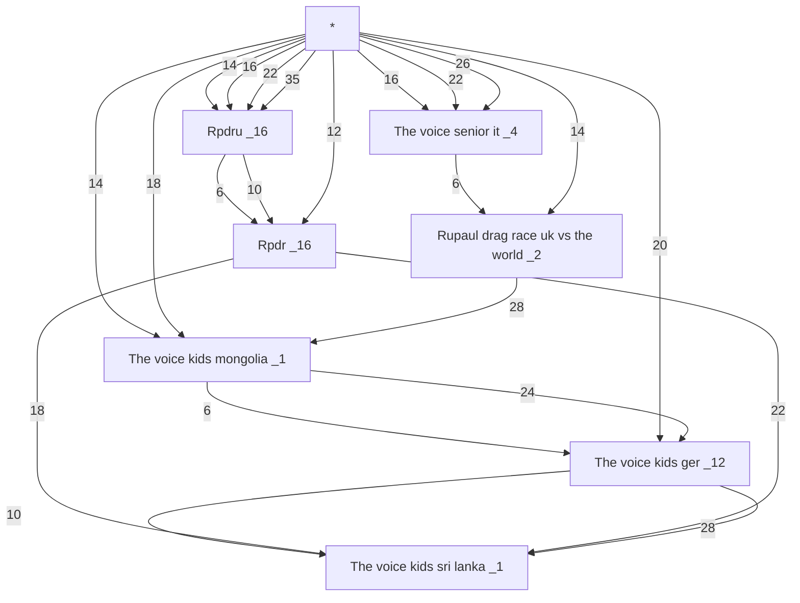
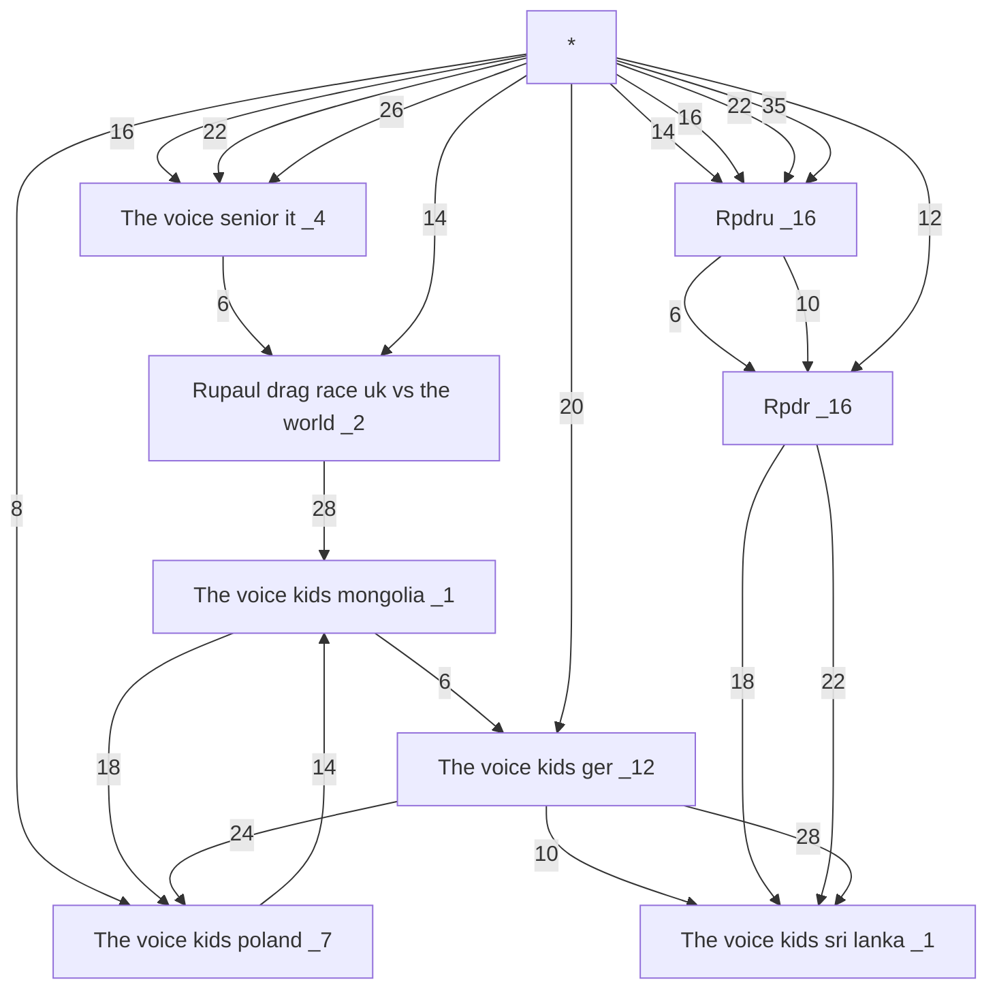
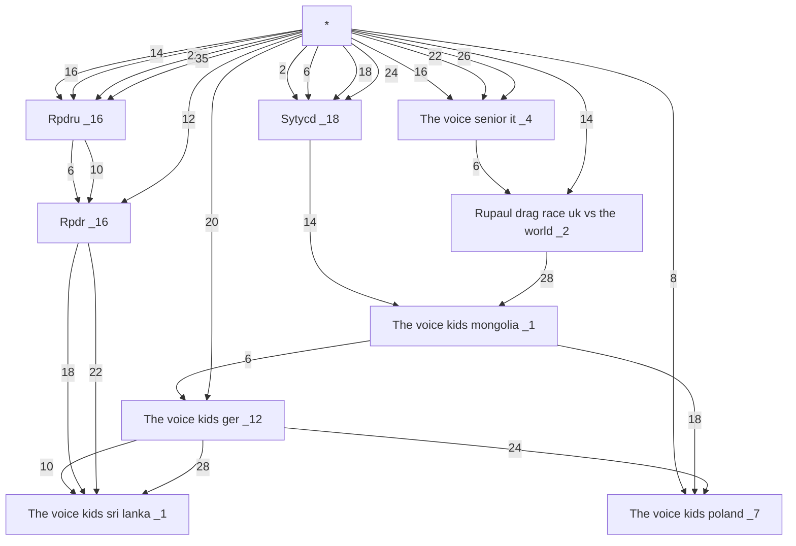
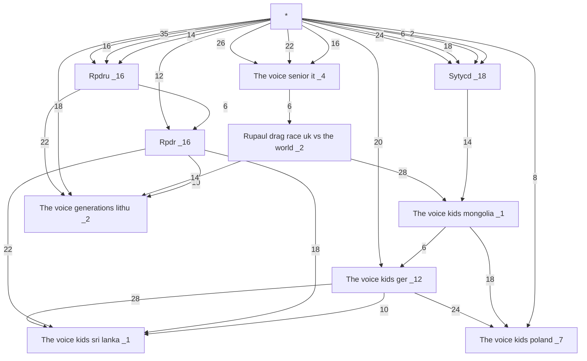
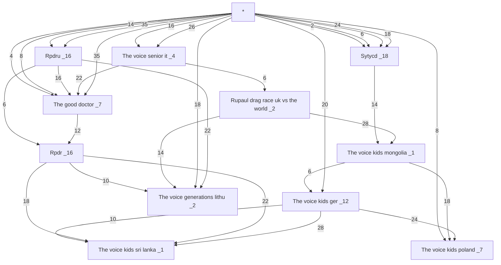
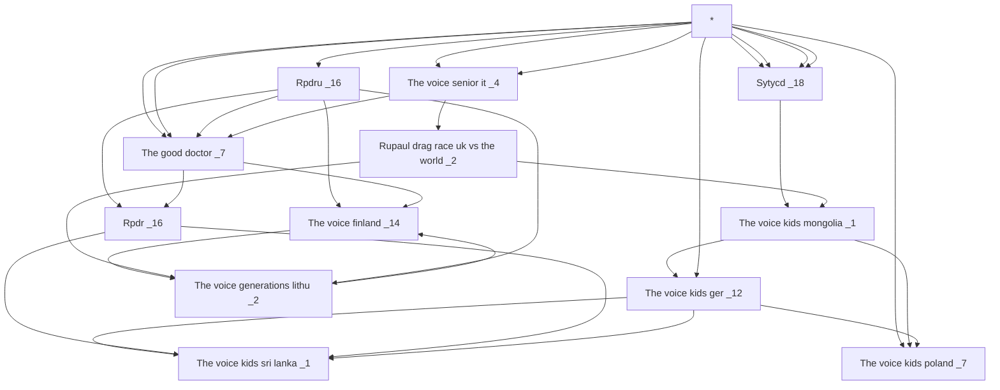
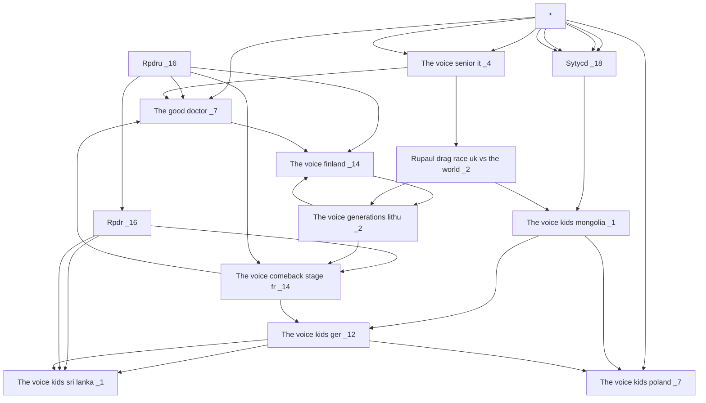
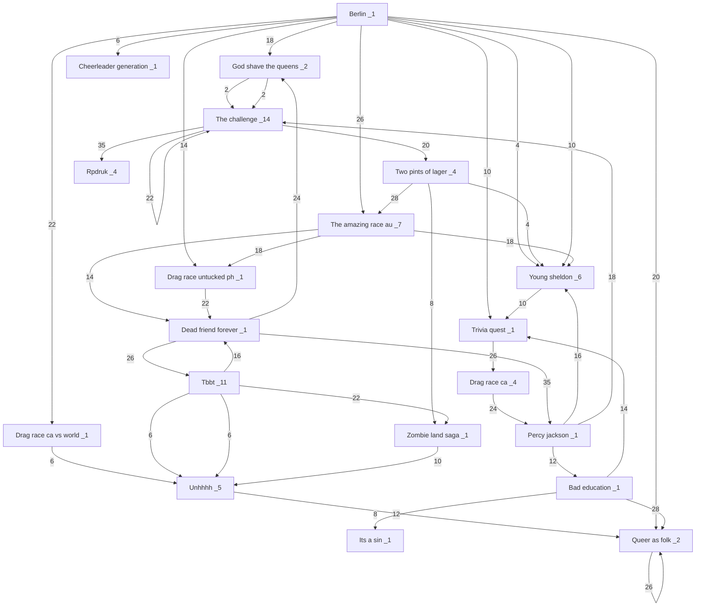

1   EN COURS

fin  

```mermaid
flowchart TD

```

-----
tous  



-----

fin  

```mermaid
flowchart TD

```

fin  tvkmongolia



fin  tvkpol



fin  sytycd



fin  tvglit



fin  tgdo



fin the voice finland



fin tvcsfr





2  RETARD

