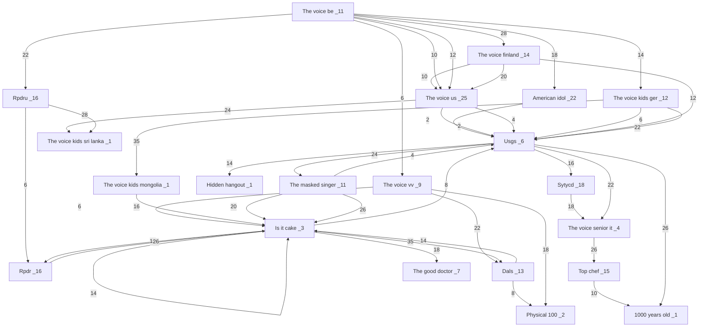
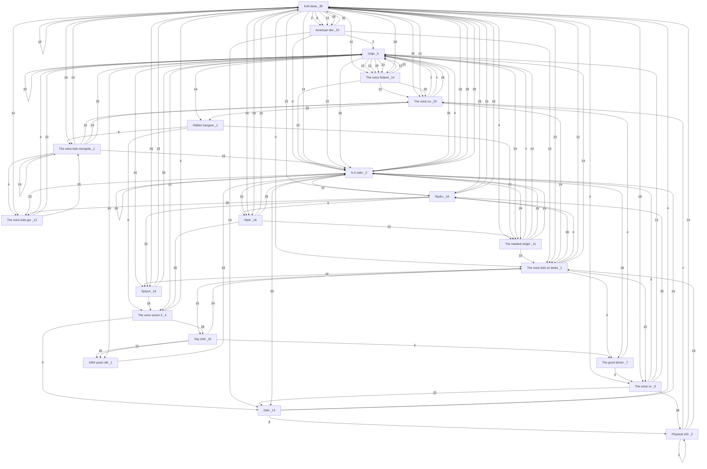
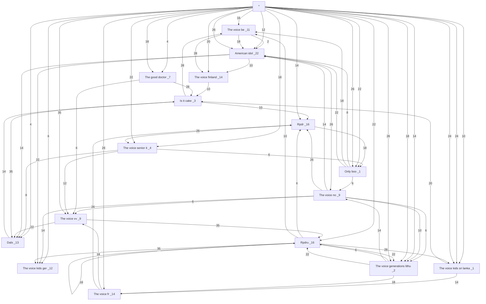
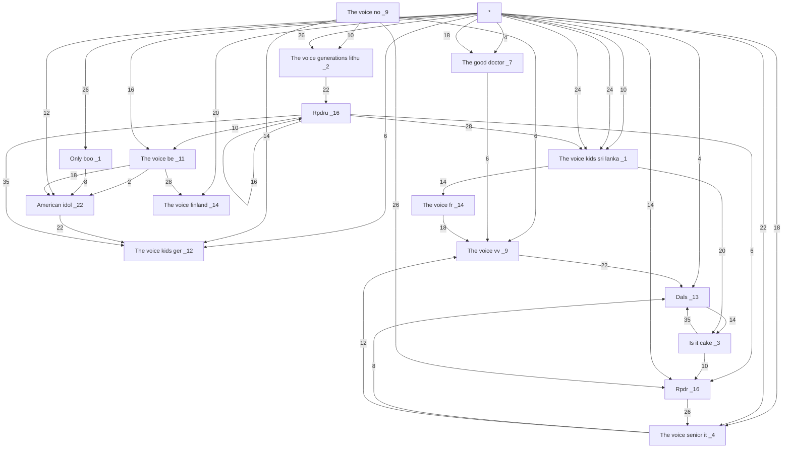
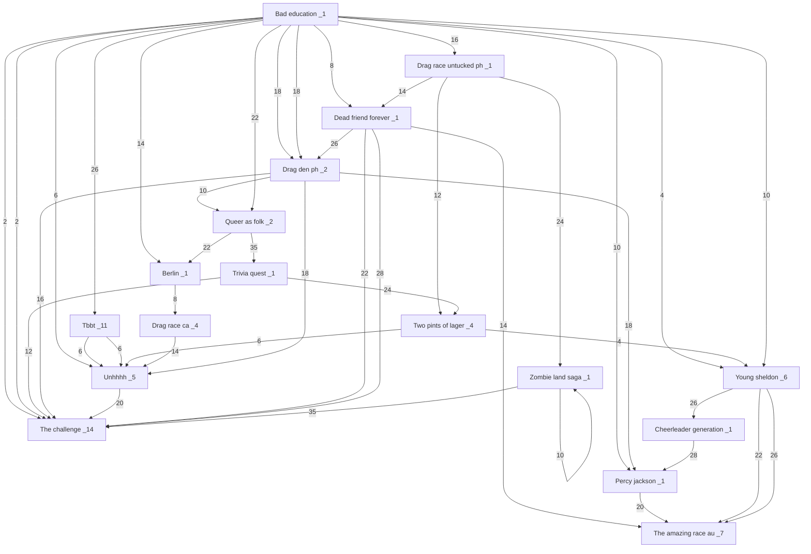

1   EN COURS

fin  

```mermaid
flowchart TD
    N[American idol _22] -- 2 --> B[Usgs _6]
D[The voice us _25] -- 2 --> B[Usgs _6]
D[The voice us _25] -- 4 --> B[Usgs _6]
L[The masked singer _11] -- 4 --> B[Usgs _6]
R[The voice kids ger _12] -- 6 --> B[Usgs _6]
Z[The voice no _9] -- 6 --> T[The voice vv _9]
M[Rpdru _16] -- 6 --> P[Rpdr _16]
T[The voice vv _9] -- 6 --> A[Is it cake _3]
C[Dals _13] -- 8 --> J[Physical 100 _2]
A[Is it cake _3] -- 8 --> B[Usgs _6]
K[Top chef _15] -- 10 --> G[1000 years old _1]
I[The voice finland _14] -- 10 --> D[The voice us _25]
Z[The voice be _11] -- 10 --> D[The voice us _25]
A[Is it cake _3] -- 10 --> P[Rpdr _16]
Z[Koh-lanta _30] -- 12 --> D[The voice us _25]
I[The voice finland _14] -- 12 --> B[Usgs _6]
A[Is it cake _3] -- 14 --> A[Is it cake _3]
Z[The voice no _9] -- 14 --> R[The voice kids ger _12]
B[Usgs _6] -- 14 --> S[Hidden hangout _1]
C[Dals _13] -- 14 --> A[Is it cake _3]
B[Usgs _6] -- 16 --> Q[Sytycd _18]
H[The voice kids mongolia _1] -- 16 --> A[Is it cake _3]
Q[Sytycd _18] -- 18 --> F[The voice senior it _4]
T[The voice vv _9] -- 18 --> J[Physical 100 _2]
Z[The voice be _11] -- 18 --> N[American idol _22]
A[Is it cake _3] -- 18 --> O[The good doctor _7]
I[The voice finland _14] -- 20 --> D[The voice us _25]
L[The masked singer _11] -- 20 --> A[Is it cake _3]
B[Usgs _6] -- 22 --> F[The voice senior it _4]
Z[The voice generations lithu _2] -- 22 --> M[Rpdru _16]
T[The voice vv _9] -- 22 --> C[Dals _13]
R[The voice kids ger _12] -- 22 --> B[Usgs _6]
D[The voice us _25] -- 24 --> E[The voice kids sri lanka _1]
B[Usgs _6] -- 24 --> L[The masked singer _11]
P[Rpdr _16] -- 26 --> A[Is it cake _3]
F[The voice senior it _4] -- 26 --> K[Top chef _15]
B[Usgs _6] -- 26 --> G[1000 years old _1]
L[The masked singer _11] -- 26 --> A[Is it cake _3]
Z[The voice be _11] -- 28 --> I[The voice finland _14]
M[Rpdru _16] -- 28 --> E[The voice kids sri lanka _1]
A[Is it cake _3] -- 35 --> C[Dals _13]
R[The voice kids ger _12] -- 35 --> H[The voice kids mongolia _1]


```

-----
tous  lundi

```mermaid
flowchart TD
    Z[The voice be _11] -- 2 --> Z[Koh-lanta _30] -- 2 --> N[American idol _22] -- 2 --> B[Usgs _6]
J[Physical 100 _2] -- 2 --> J[Physical 100 _2] -- 2 --> D[The voice us _25] -- 2 --> B[Usgs _6]
K[Top chef _15] -- 4 --> O[The good doctor _7] -- 4 --> D[The voice us _25] -- 4 --> B[Usgs _6]
C[Dals _13] -- 4 --> Z[Pekin express _18] -- 4 --> L[The masked singer _11] -- 4 --> B[Usgs _6]
S[Hidden hangout _1] -- 6 --> H[The voice kids mongolia _1] -- 6 --> R[The voice kids ger _12] -- 6 --> B[Usgs _6]
F[The voice senior it _4] -- 6 --> Z[Only boo _1] -- 6 --> Z[The voice no _9] -- 6 --> T[The voice vv _9]
Z[The voice generations lithu _2] -- 6 --> E[The voice kids sri lanka _1] -- 6 --> M[Rpdru _16] -- 6 --> P[Rpdr _16]
E[The voice kids sri lanka _1] -- 6 --> O[The good doctor _7] -- 6 --> T[The voice vv _9] -- 6 --> A[Is it cake _3]
S[Hidden hangout _1] -- 8 --> F[The voice senior it _4] -- 8 --> C[Dals _13] -- 8 --> J[Physical 100 _2]
Z[Only boo _1] -- 8 --> N[American idol _22] -- 8 --> A[Is it cake _3] -- 8 --> B[Usgs _6]
L[The masked singer _11] -- 10 --> E[The voice kids sri lanka _1] -- 10 --> K[Top chef _15] -- 10 --> G[1000 years old _1]
Z[The voice kids poland _7] -- 10 --> Z[The voice generations lithu _2] -- 10 --> I[The voice finland _14] -- 10 --> D[The voice us _25]
A[Is it cake _3] -- 10 --> M[Rpdru _16] -- 10 --> Z[The voice be _11] -- 10 --> D[The voice us _25]
B[Usgs _6] -- 10 --> I[The voice finland _14] -- 10 --> A[Is it cake _3] -- 10 --> P[Rpdr _16]
N[American idol _22] -- 12 --> E[The voice kids sri lanka _1] -- 12 --> Z[Koh-lanta _30] -- 12 --> D[The voice us _25]
T[The voice vv _9] -- 12 --> B[Usgs _6] -- 12 --> I[The voice finland _14] -- 12 --> B[Usgs _6]
J[Physical 100 _2] -- 14 --> Z[The voice fr _14] -- 14 --> A[Is it cake _3] -- 14 --> A[Is it cake _3]
H[The voice kids mongolia _1] -- 14 --> Z[The voice generations lithu _2] -- 14 --> Z[The voice no _9] -- 14 --> R[The voice kids ger _12]
P[Rpdr _16] -- 14 --> L[The masked singer _11] -- 14 --> B[Usgs _6] -- 14 --> S[Hidden hangout _1]
Z[The voice kids poland _7] -- 14 --> N[American idol _22] -- 14 --> C[Dals _13] -- 14 --> A[Is it cake _3]
H[The voice kids mongolia _1] -- 16 --> D[The voice us _25] -- 16 --> B[Usgs _6] -- 16 --> Q[Sytycd _18]
M[Rpdru _16] -- 16 --> Z[Koh-lanta _30] -- 16 --> H[The voice kids mongolia _1] -- 16 --> A[Is it cake _3]
J[Physical 100 _2] -- 18 --> E[The voice kids sri lanka _1] -- 18 --> Q[Sytycd _18] -- 18 --> F[The voice senior it _4]
A[Is it cake _3] -- 18 --> Z[The voice fr _14] -- 18 --> T[The voice vv _9] -- 18 --> J[Physical 100 _2]
P[Rpdr _16] -- 18 --> Z[Only boo _1] -- 18 --> Z[The voice be _11] -- 18 --> N[American idol _22]
K[Top chef _15] -- 18 --> G[1000 years old _1] -- 18 --> A[Is it cake _3] -- 18 --> O[The good doctor _7]
B[Usgs _6] -- 20 --> B[Usgs _6] -- 20 --> I[The voice finland _14] -- 20 --> D[The voice us _25]
D[The voice us _25] -- 20 --> S[Hidden hangout _1] -- 20 --> L[The masked singer _11] -- 20 --> A[Is it cake _3]
B[Usgs _6] -- 22 --> I[The voice finland _14] -- 22 --> B[Usgs _6] -- 22 --> F[The voice senior it _4]
M[Rpdru _16] -- 22 --> Q[Sytycd _18] -- 22 --> Z[The voice generations lithu _2] -- 22 --> M[Rpdru _16]
Z[Koh-lanta _30] -- 22 --> E[The voice kids sri lanka _1] -- 22 --> T[The voice vv _9] -- 22 --> C[Dals _13]
N[American idol _22] -- 22 --> A[Is it cake _3] -- 22 --> R[The voice kids ger _12] -- 22 --> B[Usgs _6]
H[The voice kids mongolia _1] -- 24 --> H[The voice kids mongolia _1] -- 24 --> D[The voice us _25] -- 24 --> E[The voice kids sri lanka _1]
K[Top chef _15] -- 24 --> E[The voice kids sri lanka _1] -- 24 --> B[Usgs _6] -- 24 --> L[The masked singer _11]
N[American idol _22] -- 26 --> Z[The voice no _9] -- 26 --> P[Rpdr _16] -- 26 --> A[Is it cake _3]
Z[The voice fr _14] -- 26 --> P[Rpdr _16] -- 26 --> F[The voice senior it _4] -- 26 --> K[Top chef _15]
Z[Only boo _1] -- 26 --> Q[Sytycd _18] -- 26 --> B[Usgs _6] -- 26 --> G[1000 years old _1]
B[Usgs _6] -- 26 --> A[Is it cake _3] -- 26 --> L[The masked singer _11] -- 26 --> A[Is it cake _3]
A[Is it cake _3] -- 28 --> A[Is it cake _3] -- 28 --> Z[The voice be _11] -- 28 --> I[The voice finland _14]
A[Is it cake _3] -- 28 --> Z[Koh-lanta _30] -- 28 --> M[Rpdru _16] -- 28 --> E[The voice kids sri lanka _1]
H[The voice kids mongolia _1] -- 35 --> B[Usgs _6] -- 35 --> A[Is it cake _3] -- 35 --> C[Dals _13]
T[The voice vv _9] -- 35 --> M[Rpdru _16] -- 35 --> R[The voice kids ger _12] -- 35 --> H[The voice kids mongolia _1]


```

tous  dim

```mermaid
flowchart TD
    L[The voice be _11] -- 2 --> H[American idol _22] 
P[*] -- 4 --> N[The good doctor _7] 
P[*] -- 4 --> C[Dals _13] 
P[*] -- 6 --> B[The voice kids ger _12] 
D[The voice senior it _4] -- 6 --> M[Only boo _1]  -- 6 --> Z[The voice no _9] -- 6 --> G[The voice vv _9] 
Z[The voice kids poland _7] -- 6 --> J[The voice generations lithu _2]  -- 6 --> I[Rpdru _16] -- 6 --> E[Rpdr _16] 
N[The good doctor _7] -- 6 --> G[The voice vv _9] 
D[The voice senior it _4] -- 8 --> C[Dals _13] 
M[Only boo _1] -- 8 --> H[American idol _22] 
P[*] -- 10 --> A[The voice kids sri lanka _1] 
Z[The voice kids poland _7] -- 10 --> J[The voice generations lithu _2] 
I[Rpdru _16] -- 10 --> L[The voice be _11] 
H[American idol _22] -- 10 --> F[The voice finland _14]  -- 10 --> K[Is it cake _3] -- 10 --> E[Rpdr _16] 
P[*] -- 12 --> H[American idol _22] 
D[The voice senior it _4] -- 12 --> G[The voice vv _9] 
A[The voice kids sri lanka _1] -- 14 --> O[The voice fr _14] 
P[*] -- 14 --> J[The voice generations lithu _2]  -- 14 --> Z[The voice no _9] -- 14 --> B[The voice kids ger _12] 
P[*] -- 14 --> E[Rpdr _16] 
Z[The voice kids poland _7] -- 14 --> H[American idol _22]  -- 14 --> C[Dals _13] -- 14 --> K[Is it cake _3] 
P[*] -- 16 --> L[The voice be _11] 
I[Rpdru _16] -- 16 --> I[Rpdru _16] 
P[*] -- 18 --> D[The voice senior it _4] 
P[*] -- 18 --> J[The voice generations lithu _2]  -- 18 --> O[The voice fr _14] -- 18 --> G[The voice vv _9] 
E[Rpdr _16] -- 18 --> M[Only boo _1]  -- 18 --> L[The voice be _11] -- 18 --> H[American idol _22] 
P[*] -- 18 --> N[The good doctor _7] 
P[*] -- 20 --> F[The voice finland _14] 
A[The voice kids sri lanka _1] -- 20 --> K[Is it cake _3] 
P[*] -- 22 --> D[The voice senior it _4] 
P[*] -- 22 --> I[Rpdru _16]  -- 22 --> J[The voice generations lithu _2] -- 22 --> I[Rpdru _16] 
G[The voice vv _9] -- 22 --> C[Dals _13] 
P[*] -- 22 --> M[Only boo _1]  -- 22 --> H[American idol _22] -- 22 --> B[The voice kids ger _12] 
P[*] -- 24 --> A[The voice kids sri lanka _1] 
P[*] -- 24 --> A[The voice kids sri lanka _1] 
P[*] -- 26 --> H[American idol _22]  -- 26 --> Z[The voice no _9] -- 26 --> E[Rpdr _16] 
P[*] -- 26 --> O[The voice fr _14]  -- 26 --> E[Rpdr _16] -- 26 --> D[The voice senior it _4] 
P[*] -- 26 --> M[Only boo _1] 
P[*] -- 26 --> J[The voice generations lithu _2] 
N[The good doctor _7] -- 28 --> K[Is it cake _3]  -- 28 --> L[The voice be _11] -- 28 --> F[The voice finland _14] 
I[Rpdru _16] -- 28 --> A[The voice kids sri lanka _1] 
K[Is it cake _3] -- 35 --> C[Dals _13] 
P[*] -- 35 --> G[The voice vv _9]  -- 35 --> I[Rpdru _16] -- 35 --> B[The voice kids ger _12] 
```
-----

fin  

```mermaid
flowchart TD

```

etat vendredi

```mermaid
flowchart TD
    L[The voice be _11] -- 2 --> H[American idol _22] 
P[*] -- 4 --> N[The good doctor _7] 
P[*] -- 4 --> C[Dals _13] 
P[*] -- 6 --> B[The voice kids ger _12] 
Z[The voice no _9] -- 6 --> G[The voice vv _9] 
I[Rpdru _16] -- 6 --> E[Rpdr _16] 
N[The good doctor _7] -- 6 --> G[The voice vv _9] 
D[The voice senior it _4] -- 8 --> C[Dals _13] 
M[Only boo _1] -- 8 --> H[American idol _22] 
P[*] -- 10 --> A[The voice kids sri lanka _1] 
Z[The voice kids poland _7] -- 10 --> J[The voice generations lithu _2] 
I[Rpdru _16] -- 10 --> L[The voice be _11] 
K[Is it cake _3] -- 10 --> E[Rpdr _16] 
P[*] -- 12 --> H[American idol _22] 
D[The voice senior it _4] -- 12 --> G[The voice vv _9] 
A[The voice kids sri lanka _1] -- 14 --> O[The voice fr _14] 
Z[The voice no _9] -- 14 --> B[The voice kids ger _12] 
P[*] -- 14 --> E[Rpdr _16] 
C[Dals _13] -- 14 --> K[Is it cake _3] 
P[*] -- 16 --> L[The voice be _11] 
I[Rpdru _16] -- 16 --> I[Rpdru _16] 
P[*] -- 18 --> D[The voice senior it _4] 
O[The voice fr _14] -- 18 --> G[The voice vv _9] 
L[The voice be _11] -- 18 --> H[American idol _22] 
P[*] -- 18 --> N[The good doctor _7] 
P[*] -- 20 --> F[The voice finland _14] 
A[The voice kids sri lanka _1] -- 20 --> K[Is it cake _3] 
P[*] -- 22 --> D[The voice senior it _4] 
J[The voice generations lithu _2] -- 22 --> I[Rpdru _16] 
G[The voice vv _9] -- 22 --> C[Dals _13] 
H[American idol _22] -- 22 --> B[The voice kids ger _12] 
P[*] -- 24 --> A[The voice kids sri lanka _1] 
P[*] -- 24 --> A[The voice kids sri lanka _1] 
Z[The voice no _9] -- 26 --> E[Rpdr _16] 
E[Rpdr _16] -- 26 --> D[The voice senior it _4] 
P[*] -- 26 --> M[Only boo _1] 
P[*] -- 26 --> J[The voice generations lithu _2] 
L[The voice be _11] -- 28 --> F[The voice finland _14] 
I[Rpdru _16] -- 28 --> A[The voice kids sri lanka _1] 
K[Is it cake _3] -- 35 --> C[Dals _13] 
I[Rpdru _16] -- 35 --> B[The voice kids ger _12] 
```

2  RETARD

```mermaid
flowchart TD
    Z[God shave the queens _2] -- 2 --> A[The challenge _14] 
Z[God shave the queens _2] -- 2 --> A[The challenge _14] 
Z[House of drag _2] -- 4 --> N[Young sheldon _6] 
F[Two pints of lager _4] -- 4 --> N[Young sheldon _6] 
Z[Drag race ca vs world _1] -- 6 --> D[Unhhhh _5] 
L[Tbbt _11] -- 6 --> D[Unhhhh _5] 
L[Tbbt _11] -- 6 --> D[Unhhhh _5] 
F[Two pints of lager _4] -- 6 --> D[Unhhhh _5] 
G[Berlin _1] -- 8 --> P[Drag race ca _4] 
Z[Rpdruk _4] -- 8 --> M[Dead friend forever _1] 
I[Zombie land saga _1] -- 10 --> I[Zombie land saga _1] 
Z[Rpdruk _4] -- 10 --> N[Young sheldon _6] 
C[Drag den ph _2] -- 10 --> J[Queer as folk _2] 
Z[Rpdruk _4] -- 10 --> E[Percy jackson _1] 
H[Trivia quest _1] -- 12 --> A[The challenge _14] 
O[Drag race untucked ph _1] -- 12 --> F[Two pints of lager _4] 
M[Dead friend forever _1] -- 14 --> B[The amazing race au _7] 
Z[Bad education _1] -- 14 --> G[Berlin _1] 
P[Drag race ca _4] -- 14 --> D[Unhhhh _5] 
O[Drag race untucked ph _1] -- 14 --> M[Dead friend forever _1] 
Z[Wtfock _7] -- 16 --> O[Drag race untucked ph _1] 
C[Drag den ph _2] -- 16 --> A[The challenge _14] 
Z[Wtfock _7] -- 18 --> C[Drag den ph _2] 
C[Drag den ph _2] -- 18 --> E[Percy jackson _1] 
C[Drag den ph _2] -- 18 --> D[Unhhhh _5] 
Z[Queer eye _4] -- 18 --> C[Drag den ph _2] 
D[Unhhhh _5] -- 20 --> A[The challenge _14] 
E[Percy jackson _1] -- 20 --> B[The amazing race au _7] 
J[Queer as folk _2] -- 22 --> G[Berlin _1] 
Z[Bad education _1] -- 22 --> J[Queer as folk _2] 
M[Dead friend forever _1] -- 22 --> A[The challenge _14] 
N[Young sheldon _6] -- 22 --> B[The amazing race au _7] 
O[Drag race untucked ph _1] -- 24 --> I[Zombie land saga _1] 
H[Trivia quest _1] -- 24 --> F[Two pints of lager _4] 
N[Young sheldon _6] -- 26 --> K[Cheerleader generation _1] 
Z[Bad education _1] -- 26 --> L[Tbbt _11] 
N[Young sheldon _6] -- 26 --> B[The amazing race au _7] 
M[Dead friend forever _1] -- 26 --> C[Drag den ph _2] 
M[Dead friend forever _1] -- 28 --> A[The challenge _14] 
K[Cheerleader generation _1] -- 28 --> E[Percy jackson _1] 
I[Zombie land saga _1] -- 35 --> A[The challenge _14] 
J[Queer as folk _2] -- 35 --> H[Trivia quest _1] 

```
