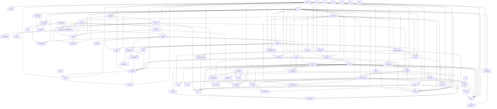

```mermaid
flowchart TD
    J[ALEA] --> A[home]
    D[Réponses au formulaire 2] --> B[dashboard]
    D --> C[search]
    K[param] --> D
    BS[categories] --> D
    D --> F[dataALL]
    F --> G[data]
    G --> H[LD]
    I[LDALL] --> H
    J --> H
    F --> I
    BB[nbTpsP] --> J
    BW[levels] --> J
    BY[TRS] --> J
    D --> K
    F --> K
    AK[liste desc] --> K
    J --> L[menu]
    BM[TVTIME] --> L
    BW --> L
    J --> M[menu2]
    P[copy by script] --> M
    AE[ep suiv] --> M
    AH[en cours occ] --> M
    AS[affODD] --> M
    AZ[smra] --> M
    M --> N[menu2b]
    P --> N
    S[PA] --> N
    AF[epSuiv2] --> N
    P --> O[cps]
    AL[listes complete] --> O
    M --> P
    AK --> P
    P --> Q[max]
    AE --> Q
    H --> R[copyGraph]
    P --> R
    BN[tracker] --> R
    AH --> S
    AI[OCC_ec] --> S
    AM[premDerAll] --> S
    AP[ODD_ssChgmt] --> S
    AS --> S
    AZ --> S
    J --> U[cal23]
    G --> V[rest]
    W[resteData] --> V
    X[EC/FIN] --> V
    BB --> V
    G --> W
    V --> W
    AK --> W
    W --> X
    BS --> Y[BL]
    AS --> AA[choixdate]
    F --> AB[list finished]
    H --> AB
    BS --> AB
    G --> AC[list ongoing]
    W --> AC
    BS --> AC
    V --> AD[all_config]
    X --> AD
    AC --> AD
    AE --> AD
    H --> AE
    AK --> AE
    AE --> AF
    H --> AG[ECocc]
    I --> AG
    AK --> AG
    AL --> AG
    AN[duree] --> AG
    J --> AH
    AG --> AH
    J --> AI
    X --> AI
    AG --> AI
    AK --> AI
    H --> AJ[listes]
    J --> AJ
    U --> AJ
    V --> AJ
    AK --> AJ
    AM --> AJ
    AZ --> AJ
    BB --> AJ
    BD[tpsEnMin] --> AJ
    H --> AK
    H --> AL
    I --> AL
    AK --> AL
    H --> AM
    AK --> AM
    H --> AN
    H --> AO[ODD_all]
    AR[ODD] --> AO
    J --> AP
    AN --> AP
    H --> AQ[ODD_ter]
    AR --> AQ
    H --> AR
    AA --> AR
    AS --> AR
    J --> AS
    AO --> AS
    AQ --> AS
    AR --> AS
    F --> AT[favoris]
    V --> AU[ordoConf]
    AV[ordo] --> AU
    AW[planning] --> AU
    AU --> AV
    J --> AW
    AU --> AW
    AV --> AW
    AX[calMonth] --> AW
    U --> AX
    AA --> AX
    P --> AY[tisaep]
    T --> AY
    X --> AY
    AL --> AY
    J --> AZ
    P --> AZ
    AL --> AZ
    H --> BB
    J --> BB
    BC[nbTpsPbis] --> BB
    H --> BC
    I --> BC
    J --> BC
    H --> BD
    J --> BD
    BE --> BD
    H --> BE[tpsEnMinConf]
    I --> BE
    J --> BE
    I --> BF[rew]
    F --> BG[rewindALLa]
    I --> BG
    I --> BH[rewindALLb]
    BG --> BH
    H --> BI[rewind23a]
    BJ[rewind23b] <--> BI
    H --> BJ
    BG --> BK[rewindALL]
    BH --> BK
    BI --> BL[rewind23]
    BJ --> BL
    J --> BM
    V --> BM
    BB --> BM
    BD --> BM
    BG --> BM
    BH --> BM
    BY --> BM
    V --> BN
    X --> BN
    AE --> BN
    X --> BO[toTab]
    AY --> BO
    AZ --> BO
    H --> BP[nb31jRec]
    J --> BP
    AE --> BP
    H --> BQ[nb7]
    J --> BQ
    V --> BQ
    AE --> BQ
    AH --> BQ
    AI --> BQ
    BO --> BQ
    BP --> BR[graphNb]
    BQ --> BR
    F --> BW
    BM --> BW
    BU[char] --> BW
    H --> BY
    I --> BY
    J --> BY
    E
    T
    Z
    BA
    BT
    BV
    BX
```

3  
```mermaid
```

4  
```mermaid
```

