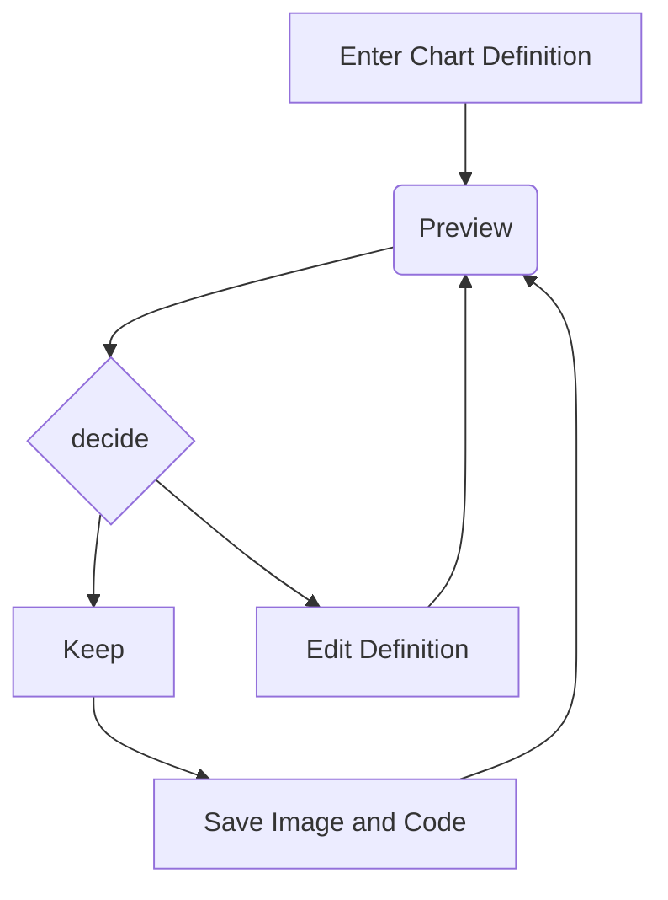
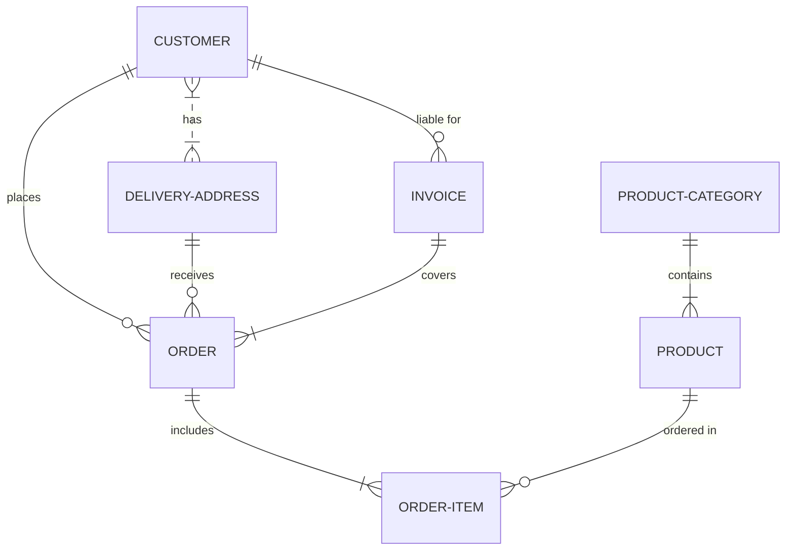

```mermaid
graph TD
    A[Enter Chart Definition] --> B(Preview)
    B --> C{decide}
    C --> D[Keep]
    C --> E[Edit Definition]
    E --> B
    D --> F[Save Image and Code]
    F --> B
```

```mermaid
erDiagram
          CUSTOMER }|..|{ DELIVERY-ADDRESS : has
          CUSTOMER ||--o{ ORDER : places
          CUSTOMER ||--o{ INVOICE : "liable for"
          DELIVERY-ADDRESS ||--o{ ORDER : receives
          INVOICE ||--|{ ORDER : covers
          ORDER ||--|{ ORDER-ITEM : includes
          PRODUCT-CATEGORY ||--|{ PRODUCT : contains
          PRODUCT ||--o{ ORDER-ITEM : "ordered in"
```