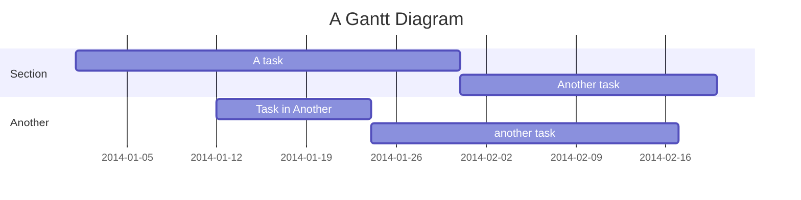
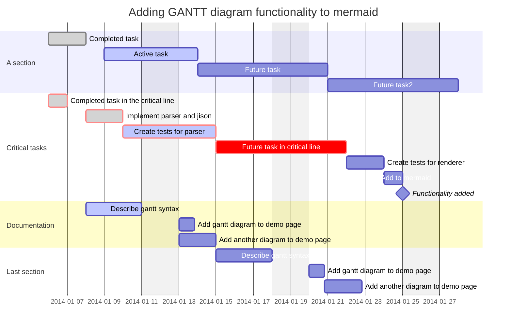
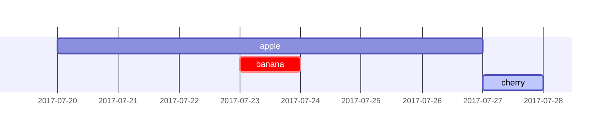
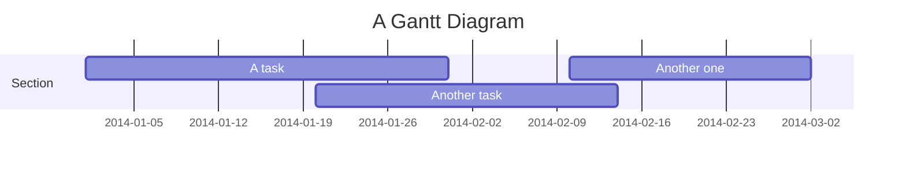

1  

2  

3  

4  

```mermaid
gantt
    dateFormat HH:mm
    axisFormat %H:%M
    Initial milestone : milestone, m1, 17:49, 2m
    Task A : 10m
    Task B : 5m
    Final milestone : milestone, m2, 18:08, 4m
```

Setting dates
dateFormat defines the format of the date input of your gantt elements. How these dates are represented in the rendered chart output are defined by axisFormat.

Input date format
The default input date format is YYYY-MM-DD. You can define your custom dateFormat.

markdown
dateFormat YYYY-MM-DD
The following formatting options are supported:

Input	Example	Description
YYYY	2014	4 digit year
YY	14	2 digit year
Q	1..4	Quarter of year. Sets month to first month in quarter.
M MM	1..12	Month number
MMM MMMM	January..Dec	Month name in locale set by dayjs.locale()
D DD	1..31	Day of month
Do	1st..31st	Day of month with ordinal
DDD DDDD	1..365	Day of year
X	1410715640.579	Unix timestamp
x	1410715640579	Unix ms timestamp
H HH	0..23	24 hour time
h hh	1..12	12 hour time used with a A.
a A	am pm	Post or ante meridiem
m mm	0..59	Minutes
s ss	0..59	Seconds
S	0..9	Tenths of a second
SS	0..99	Hundreds of a second
SSS	0..999	Thousandths of a second
Z ZZ	+12:00	Offset from UTC as +-HH:mm, +-HHmm, or Z

5  

6  

7  

```mermaid
gantt
    title Git Issues - days since last update
    dateFormat X
    axisFormat %s
    section Issue19062
    71   : 0, 71
    section Issue19401
    36   : 0, 36
    section Issue193
    34   : 0, 34
    section Issue7441
    9    : 0, 9
    section Issue1300
    5    : 0, 5
```

